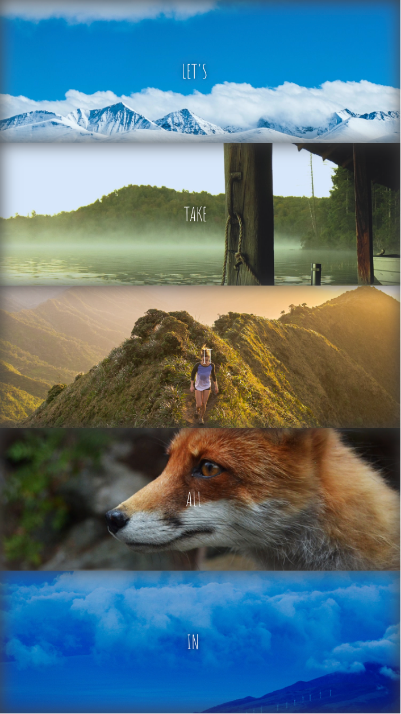
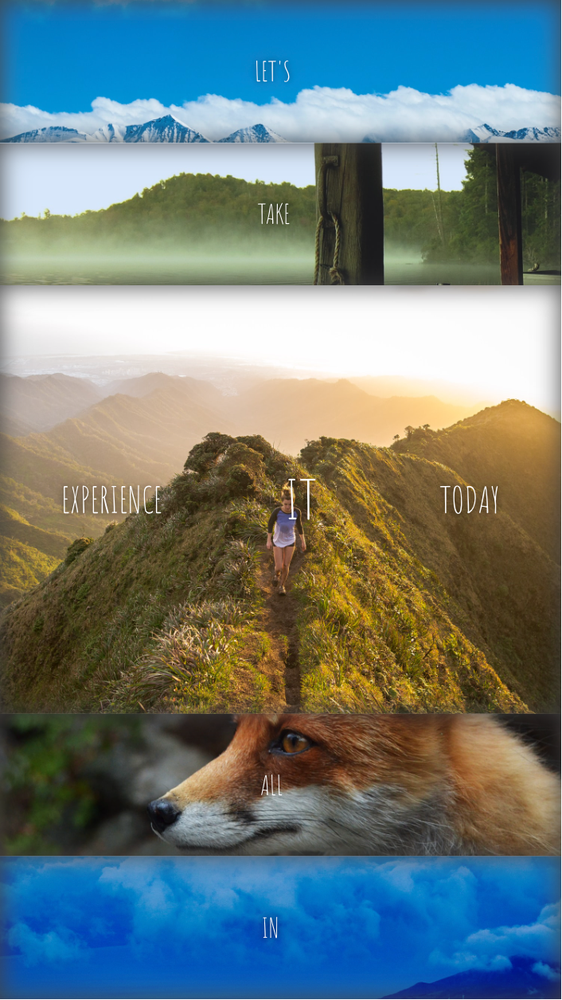

# JS30-05-Flex panel
This is a solution to the [JS30-05-Flex Panels Image Gallery](https://courses.wesbos.com/account/access/62496c1ad3e09a449732a6f9/view/194130264).

## Table of contents
  - [Overview](#overview)
    - [The challenge](#the-challenge)
    - [Screenshot](#screenshot)
    - [Links](#links)
  - [My process](#my-process)
    - [Built with](#built-with)
    - [What I learned](#what-i-learned)
    - [Continued development](#continued-development)
    - [Useful resources](#useful-resources)
  - [Author](#author)
  - [Acknowledgments](#acknowledgments)
## Overview

### The challenge
Users should be able to:
- toggle the image gallery to appreciate the whole image by clicking.

### Screenshot

  
  

### Links
- [Solution URL](https://github.com/Beginneraboutlife116/JS30-05-flex-panel)
- [Live Site URL](https://beginneraboutlife116.github.io/JS30-05-flex-panel/)

## My process

### Built with
- Semantic HTML5 markup
- CSS custom properties
- Flex box
- Mobile-first workflow

### What I learned
In this practice, I realized that it's a toggle events and also it's just a image gallery. So I decided to use CSS input checkbox to achieve that without JavaScript.

The most important things that I learned is 
1. `flex`:

### Continued development

Use this section to outline areas that you want to continue focusing on in future projects. These could be concepts you're still not completely comfortable with or techniques you found useful that you want to refine and perfect.

**Note: Delete this note and the content within this section and replace with your own plans for continued development.**

### Useful resources

- [Example resource 1](https://www.example.com) - This helped me for XYZ reason. I really liked this pattern and will use it going forward.
- [Example resource 2](https://www.example.com) - This is an amazing article which helped me finally understand XYZ. I'd recommend it to anyone still learning this concept.

**Note: Delete this note and replace the list above with resources that helped you during the challenge. These could come in handy for anyone viewing your solution or for yourself when you look back on this project in the future.**

## Author

- Website - [Add your name here](https://www.your-site.com)
- Frontend Mentor - [@yourusername](https://www.frontendmentor.io/profile/yourusername)
- Twitter - [@yourusername](https://www.twitter.com/yourusername)

**Note: Delete this note and add/remove/edit lines above based on what links you'd like to share.**

## Acknowledgments

This is where you can give a hat tip to anyone who helped you out on this project. Perhaps you worked in a team or got some inspiration from someone else's solution. This is the perfect place to give them some credit.

**Note: Delete this note and edit this section's content as necessary. If you completed this challenge by yourself, feel free to delete this section entirely.**
